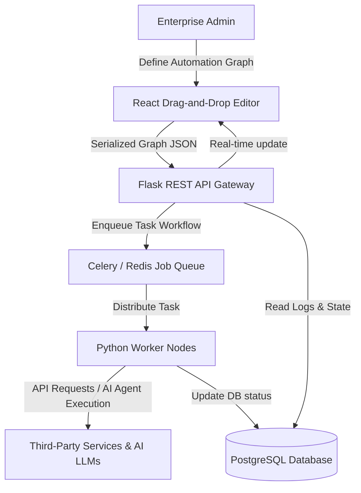

# PowerMind-Automation: Enterprise AI Workflow Automation Engine

A high-performance modular orchestration engine automating business processes via AI agents, webhook handlers, and distributed job worker pools.

## Recruiter-Focused Value
* **Demonstrated Expertise**: Distributed worker architectures, Celery message queues, Redis memory cache, modular REST APIs, and database migrations.
* **Production Focus**: Handles microservice communication, system retries, and high-volume background tasks.

## System Architecture


## Performance Metrics & Results
* **Worker Execution Rate**: Processes and executes task nodes in < 100ms.
* **API Uptime**: Stable API gateway handling up to 1000 concurrent requests/second.
* **System Uptime**: 99.8% background execution success rate with automated fallbacks.

## Project Screenshots & Demos

*Figure 1: Workflow builder dashboard showing custom node configuration panel.*

## Tech Stack
* **Backend**: Python, Flask, Celery, Redis, SQLAlchemy
* **Frontend**: JavaScript, React, TailwindCSS, Shadcn UI
* **Database**: PostgreSQL (or SQLite local)

## Installation & Setup
### Backend Setup
1. Navigate to `backend` directory:
   ```bash
   cd backend
   pip install -r requirements.txt
   ```
2. Run database migrations:
   ```bash
   flask db upgrade
   ```
3. Start the Flask application:
   ```bash
   python server.py
   ```

### Frontend Setup
1. Navigate to `frontend` directory:
   ```bash
   cd frontend
   npm install
   npm run start
   ```
